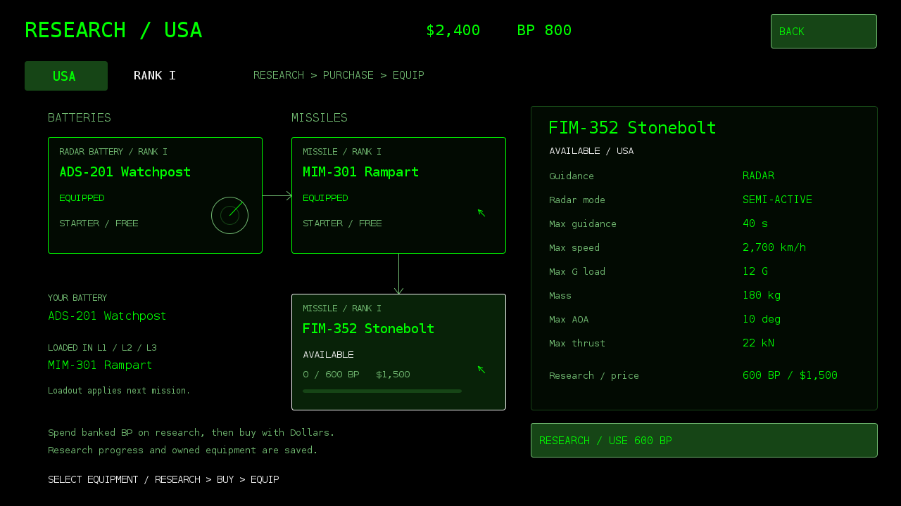

# Air Defame 101 0.9 — USA tech tree

Offline Android radar-defense game in terminal green, based on the creator's sketch and mission guides. Native landscape Canvas UI, Android 8+, package `com.jb.radar`, versionCode 9. No network/account permissions. Signed with the existing development certificate for in-place updates.

## Download

[Air-Defame-101-v0.9.apk](artifacts/Air-Defame-101-v0.9.apk)

Install over the previous version to retain Dollars, BP and best score. Uninstalling or clearing app data removes local progress. Existing mission progress does not resume after process termination.

## USA tech tree

USA is the only playable research nation. ADS-201 Watchpost and MIM-301 Rampart are free Rank I starters. FIM-352 Stonebolt follows Rampart: research for 600 BP, purchase for $1,500, then EQUIP. Research uses banked BP and saves partial progress. Purchases and equip actions are separate. One equipped missile supplies L1/L2/L3 next mission. Prices are initial game balance.

Watchpost: 30km detection, 24km tracking, 16km radar locking, five simultaneous tracks, two datalink channels, scan speed 1.00/10.00 (ten-second sweep), no IR capability. The previous HAWK/MIM-23/IR-6 starter loadout has been replaced. Existing hostile aircraft and missile loadouts remain.

| Missile | Guidance | Time | Speed | G | Mass | AOA | Thrust |
| --- | --- | ---: | ---: | ---: | ---: | ---: | ---: |
| MIM-301 Rampart | Radar / semi-active | 35s | 2,400km/h | 14 | 140kg | 12 deg | 18kN |
| FIM-352 Stonebolt | Radar / semi-active | 40s | 2,700km/h | 12 | 180kg | 10 deg | 22kN |

## Play

Defend the site against twelve aircraft during a mission of up to ten simulation minutes. Select an aircraft or incoming missile; TRACK, LOCK, then FIRE inside the battery's envelope. Maintain the target lock until interception. Target identity is uncertain and measurements depend on scan history, range, clutter and terrain. Gray means unknown, orange uncertain enemy type, red positively identified enemy. Green friendly identification is reserved for future friendly contacts.

L1/L2/L3 each hold three missiles. Nine more are in reserve; a completely empty launcher reloads in 90 simulation seconds. The fourth enemy missile impact destroys the base. Each impact also reduces radar range. Priority tracking uses no datalink channel; locks share two target channels. The selected missile's guidance, acceleration, speed, G/AOA limits and energy affect the projectile's actual flight.

The original supplied menu song loops in menu screens and pauses during gameplay, backgrounding and audio-focus loss. Optional beeps are enabled in the pause menu. 1x/2x/4x affects all simulation timers.

## Economy

Aircraft interceptions earn $250 / 100 BP; incoming-missile interceptions $150 / 75 BP; victory $500 / 250 BP; each remaining base hit on victory $100 / 50 BP. Combat rewards remain after defeat or withdrawal. Research spends BP, purchases spend Dollars, and lifetime/mission totals retain gross earnings. Ammunition/repairs are free. Balances, research, ownership and loadout save together; duplicate charges and payouts are blocked. Failed saves offer retry.

## Development

Read [PROJECT_STATUS.md](PROJECT_STATUS.md), [EQUIPMENT.md](EQUIPMENT.md), [Mission-Guide.txt](Mission-Guide.txt) and [Update-Guide-v0.9.txt](Update-Guide-v0.9.txt). Previous update guides and APKs are retained as history. All performance values are fictional game balance, not validated operational data.

Edit `assets/equipment.properties` for stats and `TechTree.java` for catalog/prices. Additional supporting flight values not supplied by the creator are documented in EQUIPMENT.md. The reusable IR engine remains dormant for future compatible systems.

Build requires Java 17 JDK, Android platform 35, build-tools 35.0.0 and zip. Set `RADAR_ANDROID_JAR`, `RADAR_BUILD_TOOLS`, `RADAR_KEYSTORE`, `RADAR_KEY_PASSWORD` and run `./build.sh`. Optional `RADAR_ECJ` selects ECJ when javac is unavailable. Signing alias: radar. Never publish the private signing key or password. A different key requires a fresh installation.

Run `./test.sh` for seven pure Java model suites and ten seeded missions. Current checks cover requested stats, partial research, purchase/equip persistence, migration, failures/retries, duplicate charges, missile motion/interception, ammunition, radar limits and rewards. Desktop renders exercise the actual drawing code and preference/audio stubs. APK signature, manifest, assets and previous signing identity were verified. No Android device/emulator installation, real audio playback or human balance playtest was available.
