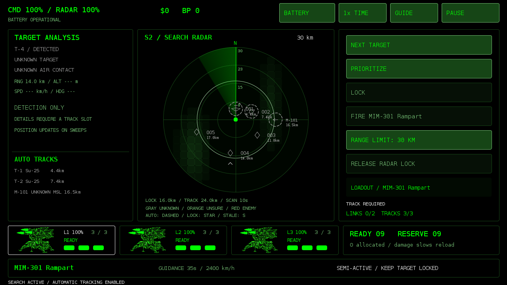
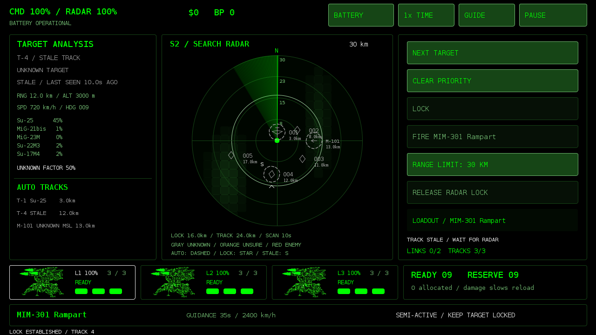
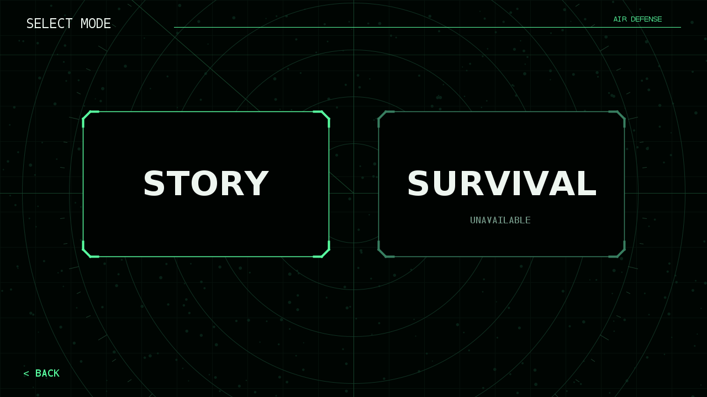
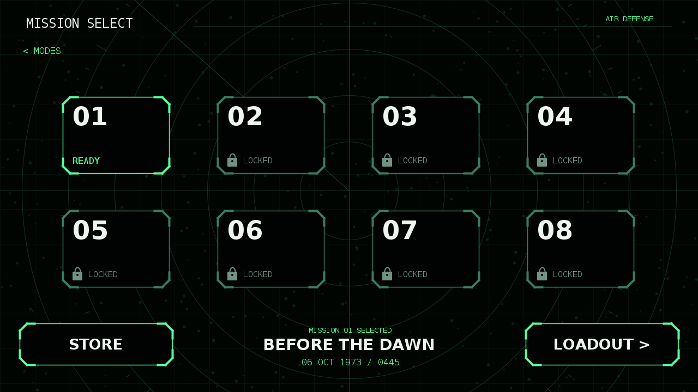
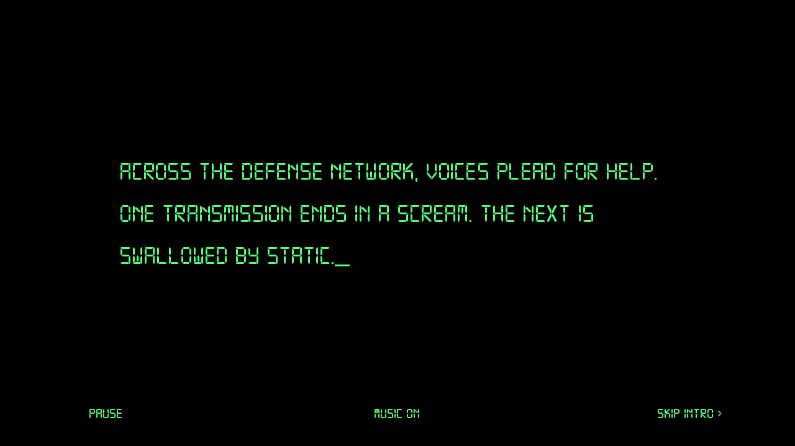
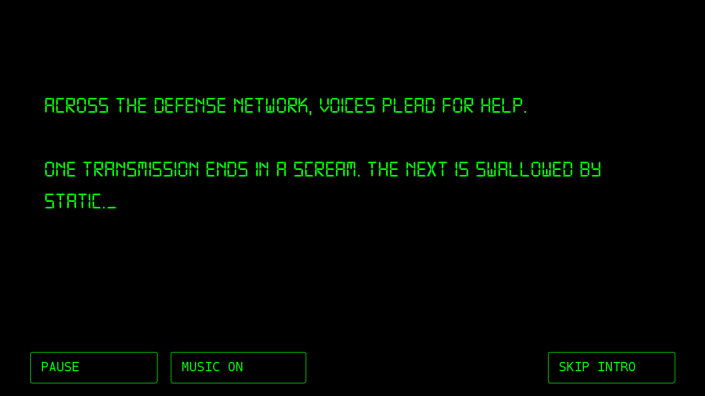
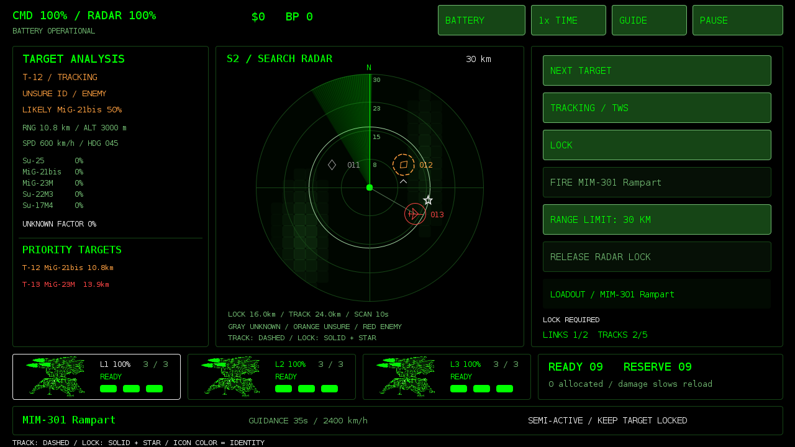
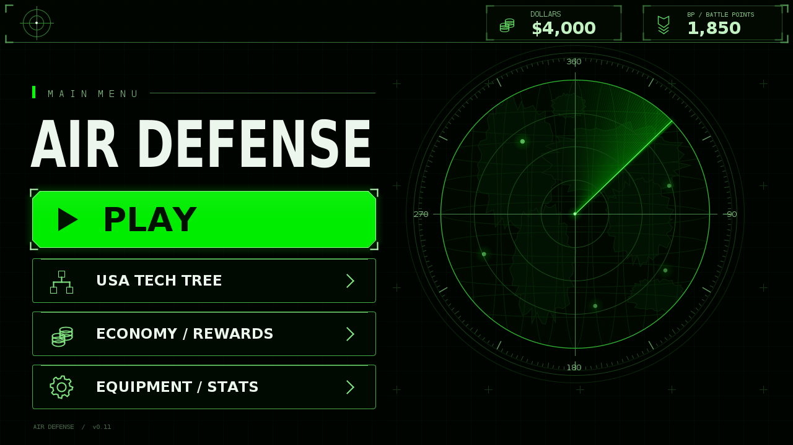
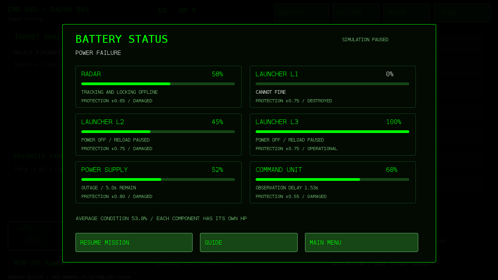

# AIR DEFENSE 0.18 — Mission 1 rookie difficulty

Offline Android radar-defense game in terminal green, based on the creator's sketch and mission guides. Native landscape Canvas UI, Android 8+, package `com.jb.radar`, versionCode 18. No network/account permissions. Signed with the existing development certificate for in-place updates.

## Download

[Air-Defense-v0.18.apk](artifacts/Air-Defense-v0.18.apk)

Install over the previous version to retain Dollars, BP and best score. Uninstalling or clearing app data removes local progress. Existing mission progress does not resume after process termination.

## New in 0.18

BEFORE THE DAWN now spawns only **Smart Level 1 / Rookie** pilots instead of random levels 1–5. Rookies recognize fewer warnings, react more slowly, favor continuing their approach and cannot perform the advanced notch maneuver. Rookies also avoid terrain-hugging approaches and low evasive dives. Fixed premature missile graze explosions so direct hits can reach and destroy moving aircraft. Smarter profiles remain available for future missions. `mission1.smartLevel=1` in `assets/combat.properties` sets the mission profile. Player missile stats, sensor limits, economy and saves are unchanged.

## New in 0.17

Built on the existing game using [REBUILD-NOTES.md](REBUILD-NOTES.md). Tracks now acquire a motion estimate before becoming stable, then coast and expire after lost contact. Radar illumination and active-missile midcourse channels are separate resources. Semi-active support can recover within a short window; active seekers distinguish searching from confirmed acquisition. Aircraft warnings depend on fictional receiver profiles rather than the internal target list. IR seeker locking does not require a battery IRST.

The loadout now includes free prototype **MIM-303 Sentinel** (active radar) and **FIM-306 Ember** (IR) so all three guidance families can be playtested. These are initial fictional balance choices; Rampart/Stonebolt retain their supplied characteristics and Stonebolt's price. All equipped families use L1–L3 ammunition and reloads. Existing saves, menus, economy, story and music are preserved. Read [Update-Guide-v0.17.txt](Update-Guide-v0.17.txt), [TRACKING.md](TRACKING.md) and [EQUIPMENT.md](EQUIPMENT.md).

Work is backed up on `radar-rebuild-v0.17`, while `main` retains v0.16. Standalone IRST search, optional retargeting and overflow eviction remain outside this first playtest build. The Watchpost has no IRST; its radar can cue an IR missile's own seeker.

## New in 0.16 (historical)

Radar tracking is automatic and limited by battery capacity. Incoming missiles take priority over ordinary aircraft; PRIORITIZE lets the player override automatic ordering without displacing locked or engaged tracks. TRACK is removed. Tracked targets have estimated altitude/speed/heading and snapshot-based motion prediction; untracked detections remain stationary between sweeps, show range and mask detail with `---`. Missed detections show STALE and freeze predictions before tracks expire. LOCK/FIRE remain independent and stale data cannot support a new launch or ground guidance. See [TRACKING.md](TRACKING.md).

## New in 0.15

PLAY opens SELECT MODE with separate STORY and SURVIVAL cards. STORY opens the reference-inspired mission grid: 01 is ready, BEFORE THE DAWN; 02–08 are nonfunctional locked placeholders. SURVIVAL is visibly unavailable and disabled. The dark animated radar background, separated chamfered frames, white labels and green accents are drawn natively.

Select 01 or LOADOUT to choose an owned missile, then START MISSION to play the existing introduction. STORE opens the existing USA research/purchase screen and returns to mission selection. Back controls and Android Back follow the menu hierarchy. No mission time, enemies or rewards start until the intro completes or is skipped. Saved ownership/loadout/balances are preserved. See [MODES.md](MODES.md).

## New in 0.14

Mission 1 now uses the supplied `Air_Defense_Digital7_Intro.zip` design: a centered, narrower text block, #58ff7e green, Digital-7 footer controls without borders, fixed full-section layout, and the ZIP's exact story punctuation, line breaks and typing cadence. Its included music replaces the previous mix byte-for-byte. Runtime is 75.64 seconds, matching the demo's approximately 76 seconds. Existing pause/mute/skip and direct radar transition remain. The HTML demo's standalone landing and ending screens are omitted when embedding into the game's existing PLAY flow, as described by its integration instructions.

## New in 0.13

Mission 1 starts with the creator's twelve-section, 76-second story on black, in bundled Digital-7 Regular and terminal green. Letters reveal at fixed positions, with an underscore cursor. PAUSE / RESUME, MUSIC ON / OFF and SKIP INTRO remain available. The supplied Watcher's Desk music fades in at 65% playback volume, crossfades into a repeat, and fades out during the final 2.5 seconds. Backgrounding and audio-focus loss pause both media and text; skipping immediately releases the music and starts radar gameplay at time zero. Restart replays the introduction from its beginning. There is no narration, threat roster or new enemy activity during the introduction. Pre-mission equipment browsing now shows only USA equipment.

See [INTRO.md](INTRO.md) for timings, audio provenance, font credit/license and verification. Digital-7 by Sizenko Alexander / Style-7 is included under its credited freeware-software terms; the supplied license is retained with the font.

## New in 0.12

TRACK now uses a dashed ring; LOCK uses a solid ring and a star. Icons retain identity colors. Active-homing profiles can launch from TRACK using shared battery channels until seeker acquisition; semi-active missiles need a maintained hard lock. Clear firing-block messages, missile support-state labels and separate AI warning events complete the update. See [TRACKING.md](TRACKING.md) for allocation and handoff rules. The current Rampart/Stonebolt loadouts remain semi-active.

## New in 0.11

Corrected the game and Android launcher name to **AIR DEFENSE**. The main menu follows the supplied reference: large white title, neon-green PLAY button, three outlined navigation rows on the left, saved Dollars/BP at the top, and a large decorative radar on the right. The sweep rotates continuously, contacts drift and fade after detection, pulses expand, scan lines move, and the PLAY button has a gentle moving highlight. Everything is drawn natively; controls remain interactive.

The displayed wallet is your actual progress, not the reference image's sample values. Package, signing identity, preference keys, loadout, game rules and original menu music are preserved. There is no extra battery/equipment card in the menu's lower-right corner. Rendering uses cached coastline paths and system typefaces; the screenshot font can differ slightly from Android's condensed font.

## New in 0.10

Explosive-based component damage replaces the four-hit rule. BATTERY shows radar, three launchers, power and command health. Bombers must reach the overhead release area; bombs have flight time and scatter. Smart Levels 1–5 govern delayed threat recognition, evasion/notch, pass aborts and retreat. Bounded behavior memories adapt to observed actions and reset each mission. Read [COMBAT-AI.md](COMBAT-AI.md) for rules, balance settings and limitations.

## USA tech tree

USA is the only playable research nation. ADS-201 Watchpost and MIM-301 Rampart are free Rank I starters. FIM-352 Stonebolt follows Rampart: research for 600 BP, purchase for $1,500, then EQUIP. Research uses banked BP and saves partial progress. Purchases and equip actions are separate. One equipped missile supplies L1/L2/L3 next mission. Prices are initial game balance.

Watchpost: 30km detection, 24km tracking, 16km radar locking, five simultaneous tracks, two target-illumination channels, two per-missile midcourse channels, scan speed 1.00/10.00 (ten-second sweep), no battery IRST. The previous HAWK/MIM-23/IR-6 starter loadout has been replaced. Existing hostile aircraft and missile loadouts remain.

| Missile | Guidance | Time | Speed | G | Mass | AOA | Thrust |
| --- | --- | ---: | ---: | ---: | ---: | ---: | ---: |
| MIM-301 Rampart | Radar / semi-active | 35s | 2,400km/h | 14 | 140kg | 12 deg | 18kN |
| FIM-352 Stonebolt | Radar / semi-active | 40s | 2,700km/h | 12 | 180kg | 10 deg | 22kN |

## Play

Defend the site against twelve aircraft during a mission of up to ten simulation minutes. Select a detected contact. Wait for a stable track for radar shots; use PRIORITIZE to request a slot. Rampart/Stonebolt need maintained LOCK, Sentinel can fire from a stable track with a free midcourse channel, and Ember needs its own IR seeker lock. Watch the guidance state and remaining resources. Target identity is uncertain and measurements depend on scan history, range, clutter and terrain. Gray means unknown, orange uncertain enemy type, red positively identified enemy. Green friendly identification is reserved for future friendly contacts.

L1/L2/L3 each hold three missiles. Nine more are in reserve; a healthy, completely empty launcher reloads in 90 simulation seconds. Damage slows reloads and radar performance. Power hits interrupt equipment; command destruction defeats the battery. Explosive charge, distance and protection determine individual component damage. Automatic tracking alone uses no guidance channel. Hard locks use target-illumination channels; active missiles use independent per-missile midcourse channels until acquisition. The selected missile's guidance, acceleration, speed, G/AOA limits and energy affect the projectile's actual flight.

The original supplied menu song loops in menu screens and pauses during gameplay, backgrounding and audio-focus loss. Optional beeps are enabled in the pause menu. 1x/2x/4x affects all simulation timers.

## Economy

Aircraft interceptions earn $250 / 100 BP; incoming-missile interceptions $150 / 75 BP; victory $500 / 250 BP; each 25% battery-condition tier on victory (rounded up) $100 / 50 BP. Combat rewards remain after defeat or withdrawal. Research spends BP, purchases spend Dollars, and lifetime/mission totals retain gross earnings. Ammunition/repairs are free. Balances, research, ownership and loadout save together; duplicate charges and payouts are blocked. Failed saves offer retry.

## Development

Read [PROJECT_STATUS.md](PROJECT_STATUS.md), [EQUIPMENT.md](EQUIPMENT.md), [Mission-Guide.txt](Mission-Guide.txt) and [Update-Guide-v0.10.txt](Update-Guide-v0.10.txt) and [AI-Decision-Flow.mmd](AI-Decision-Flow.mmd). Previous update guides and APKs are retained as history. All performance values are fictional game balance, not validated operational data.

Edit `assets/combat.properties` for damage/AI balance, `assets/equipment.properties` for stats and `TechTree.java` for catalog/prices. Additional supporting flight values not supplied by the creator are documented in EQUIPMENT.md. The IR seeker can now be used by equipping Ember; passive IRST search is not installed on Watchpost.

Build requires Java 17 JDK, Android platform 35, build-tools 35.0.0 and zip. Set `RADAR_ANDROID_JAR`, `RADAR_BUILD_TOOLS`, `RADAR_KEYSTORE`, `RADAR_KEY_PASSWORD` and run `./build.sh`. Optional `RADAR_ECJ` selects ECJ when javac is unavailable. Signing alias: radar. Never publish the private signing key or password. A different key requires a fresh installation.

Run `./test.sh` for fifteen pure Java model suites and ten seeded missions. Current checks also cover explosive falloff, component failures, warning delays, bombing release/scatter, bounded learning/reset, requested stats, partial research, purchase/equip persistence, migration, failures/retries, duplicate charges, missile motion/interception, ammunition, radar limits and rewards. Desktop renders exercise the actual drawing code and preference/audio stubs. APK signature, manifest, assets and previous signing identity were verified. No Android device/emulator installation, real audio playback or human balance playtest was available.
