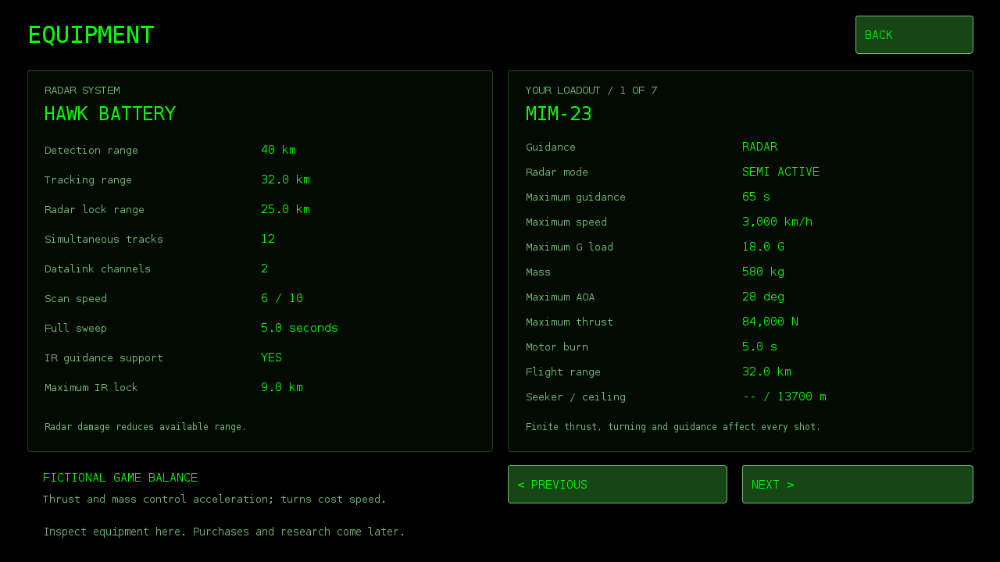

# Air Defame 101 0.8 — Mission 1

Android game based on the creator's radar sketch and supplied "HAWK Air Defense Radar Game — Mission 1" guide (included as Mission-Guide.txt). Offline, landscape, Android 8+. No network or account permissions. Package com.jb.radar; version code 8; signed with the same development key as 0.1 for an in-place update.

## Play
Defend the command site from twelve incoming aircraft during a mission of up to ten simulation minutes. Tap a blip or NEXT TARGET. Two observations establish a track. Read its estimated identity and telemetry, press TRACK, LOCK, and FIRE when within the measured engagement envelope. Maintain illumination until interception. RELEASE LOCK frees a channel but risks missiles already in flight. Protect the site; intercepts award 250 points, aircraft reaching the site cost 100; enemy missile impacts reduce radar range.

The radar starts at 40 km detection, 32 km tracking and 25 km locking, with twelve track slots. RANGE LIMIT cycles 10/20/30/40 km, with shorter presets improving measurements and identification. Each enemy missile impact removes 2–8 km cumulatively; damaged presets include the remaining maximum (for example 10/20/27). The fourth confirmed missile impact loses the mission. Remaining hits are displayed explicitly. The pale ring marks 25 km. Shaded patches are fictional hills. Unknown aircraft use heading-oriented diamonds; sufficiently confident estimated identities use aircraft silhouettes. Small arrows distinguish friendly and incoming missiles. Enemy missiles can be selected and engaged with TRACK / LOCK / FIRE, sharing the two channels with aircraft. Position and telemetry are radar observations, not perfect live data.

Select launcher L1, L2 or L3 along the bottom. Each starts with three missiles; nine more are in reserve. Only completely empty launchers reload. A reload takes 90 simulation seconds. Three reserve rounds are allocated when reloading starts and transferred when it finishes; the reserve display includes allocated rounds until completion. A full three-round reserve allocation is required. A maximum of two targets may be locked; multiple missiles may share the channel for one target.

1x / 2x / 4x changes all simulation timing, including reloads and missile flight. Pause, guide, or backgrounding freezes the mission. Gameplay beeps are optional. The supplied menu theme loops only on the title screen, and pauses for gameplay, backgrounding and audio-focus loss. Best completed mission score persists. Current missions do not survive Android process termination.

## Implemented model
- Five profiles: Su-25, MiG-21bis, MiG-23M, Su-22M3 and Su-17M4, using supplied speed, dimension and ceiling references.
- Different cruise speeds, acceleration, altitude preferences, turn limits and defensive reactions; turn-related speed loss and variable-wing size approximations.
- Unknown contacts, noisy range/speed/altitude/size/heading measurements, weighted aircraft-profile estimates, track history and confidence that can rise or fall. Su-17 and Su-22 have deliberately similar profiles. True types are revealed only in the debrief.
- Simplified radar horizon, sampled line-of-sight terrain obstruction, altitude-dependent clutter, coasting and reacquisition.
- Two illumination channels, 25 km measured slant-range launch gate, and a 13,700 m launch ceiling.
- Profile-driven missile acceleration and speed caps, turn and coast energy loss, finite G/AOA steering, terrain collision and finite guidance time.
- Hits use swept proximity geometry, not a random hit roll. A 120 m game collision tolerance is used for accessibility; it is not a claim about real missile lethality.

This is a fictional game simulation, not a validated representation of HAWK or aircraft performance. Missile motion is simplified arcade pursuit. Terrain consists of two generated ridge features. Size is an identification proxy, not radar cross section. Reference values are taken from the supplied guide, not independently verified War Thunder data.

## Build
Requires Java 17 JDK, Android platform 35, build-tools 35.0.0 and zip. Set RADAR_ANDROID_JAR, RADAR_BUILD_TOOLS, RADAR_KEYSTORE and RADAR_KEY_PASSWORD; run ./build.sh. Optional RADAR_ECJ supplies an Eclipse ECJ compiler jar if javac is absent. Signing alias: radar. The signing key is deliberately excluded from this public repository. Use your own local keystore for a fresh installation; updating the existing APK requires the original private development key retained in the owner’s source backup.

## Validation
- Compiled and verified APK signing and manifest; same signing certificate as version 0.1.
- Deterministic tests: inventory, two channels, partial-launcher restriction, 90-second reload, launch gates, coasting, terrain, missile acceleration, illumination loss, geometric interception, probability normalization, mission ending, restart.
- Ten seeded full mission simulations checked moving-target hits, mission completion, channel limit and ammunition conservation.
- Briefing and gameplay layouts inspected using a desktop rendering harness executing the app's actual drawing code against Android API stubs. This checks layout, not Android runtime behavior.
- No actual Android device/emulator installation or touch test was available. Initial gameplay balance is unvalidated by a human player.

## Download
The compiled version is in [artifacts/Air-Defame-101-v0.8.apk](artifacts/Air-Defame-101-v0.8.apk).

## Continue development
Read [PROJECT_STATUS.md](PROJECT_STATUS.md), then the mission guide and source before making changes.

## Version 0.3 UI update
User-supplied launcher illustration displayed in L1/L2/L3 cards, with separate ammunition indicators and reload status. Terminal green (#00FF00) on black replaces the teal palette; selected states use white. The original image is bundled unchanged in assets/hawk_launcher.png and decoded once at a reduced resolution. Game rules are unchanged.

## Version 0.4
The next-update guide is preserved in Update-Guide-v0.4.txt. AIR DEFAME 101 opens to a title and PLAY button. The bottom bar has NEXT TARGET / TRACK / LOCK / FIRE / RANGE LIMIT. TRACK adds priority surveillance without warning the aircraft. LOCK uses one of two channels and may trigger evasion. Identification remains uncertain; tracked aircraft receive extra measurements.

Enemy aircraft can launch simplified air-to-ground missiles after approach: Su-25 Kh-25ML/Kh-29L, MiG-23M Kh-23M, Su-22M3 Kh-27PS, Su-17M4 Kh-58U. MiG-21 has no guided ground attack. Non-ARM weapons require their source aircraft to maintain guidance; ARM weapons require radar emission. Detection, incoming warnings, cumulative range damage and impact flashes are implemented. These are fictional balancing models, including engagement distances and damage, not operational weapon simulations.

Weapon/profile reference pages: https://wiki.warthunder.com/unit/su_17m4 , https://wiki.warthunder.com/unit/su_22m3 , https://wiki.warthunder.com/unit/mig_23m , https://wiki.warthunder.com/unit/su_25 . No claim of exact real-world performance is made.

The original user-supplied menu audio is bundled unchanged as assets/menu_theme.mp3. New deterministic tests cover track/lock separation, target cycling, damaged presets, launch delay, guidance loss and radar destruction. Desktop media stubs verify lifecycle decisions, not actual sound playback. The APK still needs a real Android device installation/playtest.

## Version 0.5
Implemented Update-Guide-v0.5.txt. The right panel holds NEXT TARGET, TRACK, LOCK, FIRE, RANGE LIMIT and RELEASE LOCK; priority targets are directly below target analysis on the left. The gameplay title, top range and mission timer are removed. The title menu retains the supplied song and gains a dim, soft radar sweep background.

Contacts use gray for unknown affiliation/type, orange for known enemy with uncertain type, and red for known enemy/type. Green is reserved for future positively identified friendly targets; no friendly target spawning is added. The selected contact shows a full text identity label. Classification reflects observation history and confidence rather than revealing hidden aircraft identity. Incoming missiles can transition from gray to orange to red as observations accumulate.

The base survives three impacts and is defeated on the fourth. Range damage still accumulates. Deterministic tests intercept all five moving enemy missile profiles, verify mixed aircraft/missile channel limits, sorted target selection, ID transitions and exact fourth-hit defeat. Model regression tests and ten mission smoke runs passed. Desktop renders were inspected; actual Android playback, installation and touch testing remain unverified.

## Version 0.6 — IR-6 launcher
A separate fictional IR-6 battery adds heat-seeking missiles. Switch WEAPON on the right, select a contact, TRACK, then IR LOCK / ACTIVATE. Wait for cooling and a steady heat lock, then FIRE IR-6. The missile self-guides after launch; you can change targets or weapon mode without breaking its guidance. IR locks use no radar channels and do not trigger a radar-lock reaction. Initial selection is radar-cued, not a separate IRST search display. Selecting L1/L2/L3 switches back to radar.

IR-6 has six ready rounds and six reserve, with a 60-second reload when empty. Range depends on aspect and heat: approximately 6–9 km for aircraft, with a 9 km maximum slant launch gate and 6,000 m ceiling. Incoming missiles are also heat targets, with stronger signatures during boost. These are fictional gameplay values. Heat locks do not identify the target.

The seeker shows cooling, acquisition, lock and heat strength. Enable SOUND in the pause menu for search and lock pulses. Seeker activity times out after 30 simulation seconds. Aircraft can deploy limited flare bursts; flares can interrupt acquisition or divert a missile. Terrain and seeker view limit guidance. Full behavior and simplifications are in [Update-Guide-v0.6.txt](Update-Guide-v0.6.txt).

Verification: InfraredTest covers acquisition timing, passive locks, heat aspect, terrain, ceiling, independent flight, flare diversion, seeker cone loss, hot incoming missile interception, reload timing, inventory, pause, timeout and reset. Existing game and interception regressions and ten mission smoke runs pass. UI and music logic were exercised with desktop stubs; no Android device/emulator playtest was available.

## Version 0.7 — Dollars and Battle Points
Dollars and BP (Battle Points = XP) now persist across app restarts and in-place updates. New balances start at zero. Dollars are reserved for future equipment purchases and BP for future tech-tree research; spending and research are not implemented yet. Existing best scores are preserved.

| Action | Dollars | BP |
| --- | ---: | ---: |
| Aircraft destroyed | 250 | 100 |
| Incoming missile intercepted | 150 | 75 |
| Victory | 500 | 250 |
| Each base hit remaining after victory | 100 | 50 |

Combat rewards save immediately and remain after defeat, restarting a mission or withdrawing. Victory bonuses pay once at mission completion. Radar and IR use the same rates; misses and decoys pay nothing. The menu and gameplay display balances; ECONOMY / REWARDS shows the table, last receipt and lifetime totals. The debrief itemizes each reward.

Economy.java owns reward rules, receipts and duplicate checks. EconomyStore.java saves a single SharedPreferences transaction for balances and payout markers. Save failures show a retry action, and a new mission cannot discard pending rewards. On relaunch, unfinished missions are marked interrupted while already saved earnings remain. Local progress is removed by app-data clearing or uninstalling; no cloud sync is provided. Full scope is in Update-Guide-v0.7.txt.

Validation: EconomyTest exercises rewards, duplicate prevention, persistence/recovery, failed-write retries and real radar/IR payout hooks. Existing simulation regressions pass. A desktop Android-stub check verifies UI rendering, the preference adapter, preservation of best scores and save retry behavior. The signed APK was built and verified; no real Android device/emulator test was available.

## Version 0.8 — Configurable radar and missile mechanics

Implements [the supplied guide](Update-Guide-v0.8.txt). All requested radar and missile characteristics are loaded from [assets/equipment.properties](assets/equipment.properties) and displayed on the new EQUIPMENT / STATS menu page. Edit the asset and rebuild to tune the values; this is not an in-game stat editor. Defaults retain the HAWK / MIM-23, IR-6 and five enemy missile loadouts.

Detection, tracking and locking have separate ranges. Aircraft and incoming missiles share finite track slots and per-target datalink channels. Scan speed affects observation timing; battery IR support and IR lock range gate the seeker. Missile mass, thrust, speed, G load, AOA, motor duration and guidance time affect flight through one shared arcade motion step. Active, semi-active, passive, command, IR and source-guided laser paths are supported. See [EQUIPMENT.md](EQUIPMENT.md) for units, limits and exact simplifications.

All six model test suites and ten seeded missions pass. Desktop renders and menu/economy lifecycle checks passed; APK signature and in-place signing identity verified. No Android device/emulator was available for installation or playtesting. Dollars and BP preferences are unchanged. Run `./test.sh` for the pure Java tests.

